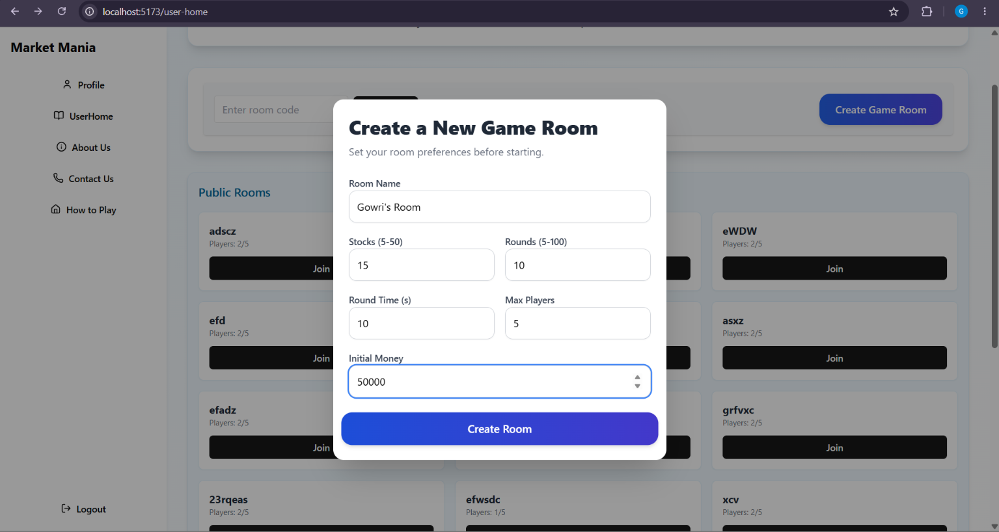
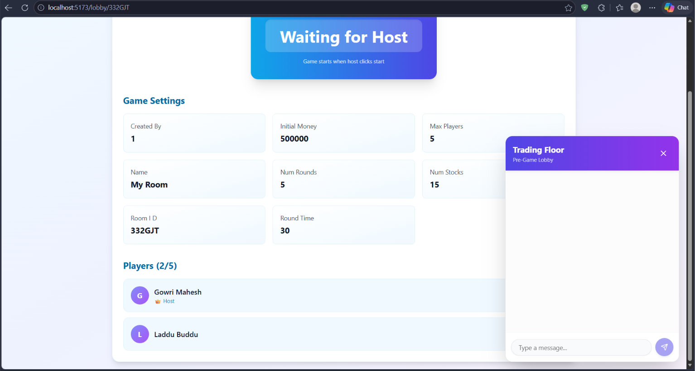
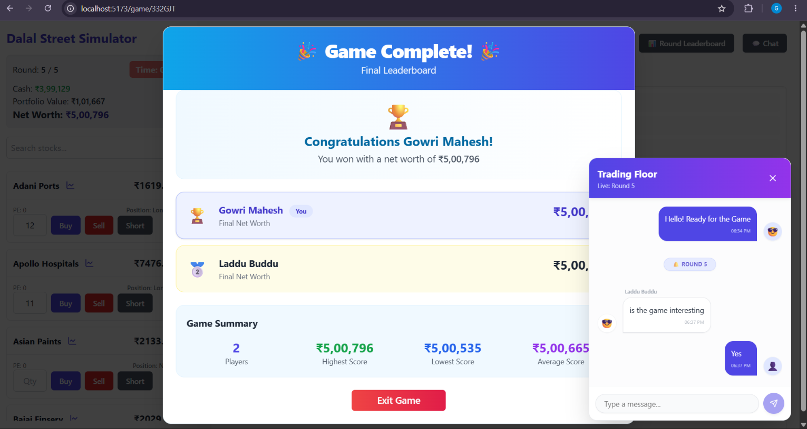
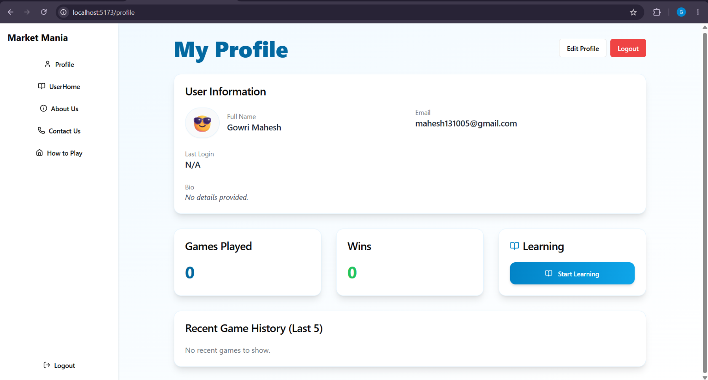
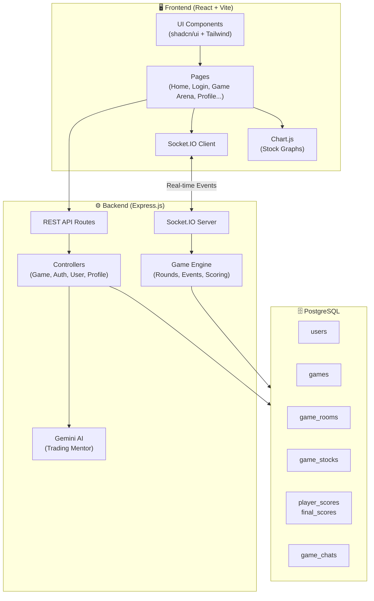
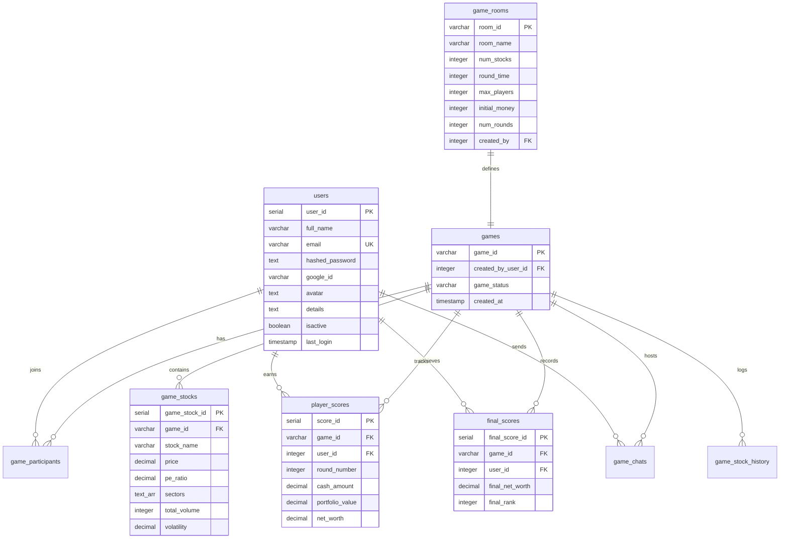

<div align="center">

# 📈 Market Mania

### _The Ultimate Multiplayer Stock Market Simulation Game_

[](https://nodejs.org/)
[](https://react.dev/)
[](https://expressjs.com/)
[](https://postgresql.org/)
[](https://socket.io/)
[](https://tailwindcss.com/)
[](https://ai.google.dev/)
[](LICENSE)

<br/>

> **Trade. Compete. Learn.** — A real-time multiplayer stock trading game where players buy and sell stocks, react to live market events, and compete for the highest net worth on the leaderboard.

<br/>


</div>

---

## 🎯 What is Market Mania?

**Market Mania** is a full-stack, real-time multiplayer stock market simulation game built for learning and fun. Players create or join game rooms, trade stocks influenced by dynamic market events and breaking news, and compete against friends to build the highest portfolio value.

Whether you're a finance enthusiast looking to sharpen your skills or a group of friends wanting a competitive trading experience — Market Mania delivers an engaging, educational, and thrilling gameplay experience.

### ✨ Key Highlights

- 🎮 **Multiplayer Rooms** — Create private game rooms with custom settings or join public ones
- 📊 **Live Stock Trading** — Buy/sell stocks with real-time price updates powered by Socket.IO
- 📰 **Dynamic Market Events** — Company news, sector shifts, and historical market shocks affect prices
- 🏆 **Round & Final Leaderboards** — Track performance after every round and at game completion
- 💬 **In-Game Chat** — Communicate with other players in the lobby and during gameplay
- 🤖 **AI Trading Mentor** — Get personalized trading advice powered by Google Gemini AI
- 📈 **Stock Price Charts** — Visual stock history graphs using Chart.js
- 👤 **User Profiles** — Customizable profiles with avatars, bios, and game history

---

## 📸 Screenshots

<details>
<summary><b>🏠 Landing Page</b> — Click to expand</summary>
<br/>
<div align="center">

</div>
<p align="center"><i>Beautiful landing page with feature cards, stats, and leaderboard preview</i></p>
</details>

<details>
<summary><b>📝 Create Account</b> — Click to expand</summary>
<br/>
<div align="center">

</div>
<p align="center"><i>User registration with email & password or Google OAuth</i></p>
</details>

<details>
<summary><b>🏡 User Dashboard</b> — Click to expand</summary>
<br/>
<div align="center">

</div>
<p align="center"><i>Dashboard with navigation sidebar, available rooms, and quick actions</i></p>
</details>

<details>
<summary><b>🎮 Creating a Game Room</b> — Click to expand</summary>
<br/>
<div align="center">

</div>
<p align="center"><i>Customize stocks count, rounds, round time, max players, and initial money</i></p>
</details>

<details>
<summary><b>🔑 Room Code</b> — Click to expand</summary>
<br/>
<div align="center">

</div>
<p align="center"><i>Shareable room code generated after room creation — share with friends to join!</i></p>
</details>

<details>
<summary><b>📋 Available Rooms</b> — Click to expand</summary>
<br/>
<div align="center">

</div>
<p align="center"><i>Browse and join public game rooms with player count indicators</i></p>
</details>

<details>
<summary><b>🏟️ Game Lobby</b> — Click to expand</summary>
<br/>
<div align="center">

</div>
<p align="center"><i>Pre-game lobby showing connected players, room settings, and chat</i></p>
</details>

<details>
<summary><b>💬 Lobby Chat</b> — Click to expand</summary>
<br/>
<div align="center">

<br/><br/>

</div>
<p align="center"><i>Real-time chat between players with avatar display — works in lobby and during gameplay</i></p>
</details>

<details>
<summary><b>🔍 Searching Stocks</b> — Click to expand</summary>
<br/>
<div align="center">

</div>
<p align="center"><i>Search and filter stocks in the game arena for quick trading</i></p>
</details>

<details>
<summary><b>📰 Live Market News</b> — Click to expand</summary>
<br/>
<div align="center">

</div>
<p align="center"><i>Dynamic news events affecting stock prices — company-specific, sector-wide, and historical market shocks</i></p>
</details>

<details>
<summary><b>🏆 Round Leaderboard</b> — Click to expand</summary>
<br/>
<div align="center">

</div>
<p align="center"><i>End-of-round leaderboard ranking players by net worth</i></p>
</details>

<details>
<summary><b>🎉 Game Completion</b> — Click to expand</summary>
<br/>
<div align="center">

</div>
<p align="center"><i>Final leaderboard with rankings, net worth comparison, and game summary</i></p>
</details>

<details>
<summary><b>👤 Profile Page</b> — Click to expand</summary>
<br/>
<div align="center">

<br/><br/>

</div>
<p align="center"><i>User profile with customizable avatar, bio, game history, and AI-powered performance analysis</i></p>
</details>

---

## 🏗️ Architecture



---

## 🛠️ Tech Stack

| Layer | Technology | Purpose |
|:---:|:---|:---|
| **Frontend** | React 19 + Vite | Fast, modern UI framework |
| **Styling** | Tailwind CSS + shadcn/ui | Utility-first CSS with beautiful components |
| **Animations** | Framer Motion | Smooth page transitions and micro-animations |
| **Charts** | Chart.js + react-chartjs-2 | Interactive stock price history graphs |
| **Icons** | Lucide React | Beautiful, consistent icon set |
| **Real-time** | Socket.IO | WebSocket-based real-time communication |
| **Backend** | Express.js 5 | Fast, minimal Node.js web framework |
| **Database** | PostgreSQL | Robust relational database |
| **Auth** | Passport.js + Google OAuth 2.0 | Secure authentication with social login |
| **AI** | Google Gemini API | AI-powered trading mentor & advice |
| **Security** | Helmet + bcrypt | HTTP security headers & password hashing |
| **Logging** | Morgan | HTTP request logging |

---

## 📂 Project Structure

```
MarketMania/
├── 📁 backend/
│   ├── 📁 config/
│   │   ├── initailiseDatabase.js    # DB connection & schema creation
│   │   └── loginAndRegisterQueries.js
│   ├── 📁 controllers/
│   │   ├── gameControllers.js       # Game room CRUD, chat, leaderboards, AI
│   │   ├── emailauthControllers.js  # Email/password authentication
│   │   ├── googleauthControllers.js # Google OAuth authentication
│   │   ├── userControllers.js       # User management
│   │   └── profileControllers.js    # Profile updates
│   ├── 📁 routes/
│   │   ├── gameRoutes.js            # /api/game/* endpoints
│   │   ├── emailauthRoutes.js       # /api/emailauth/* endpoints
│   │   ├── googleauthRoutes.js      # /api/googleauth/* endpoints
│   │   └── userRoutes.js            # /api/user/* endpoints
│   ├── 📁 utils/
│   │   └── stockFetcher.js          # Global stock price management
│   ├── 📁 scripts/                  # DB migration & utility scripts
│   └── server.js                    # Express + Socket.IO server entry
│
├── 📁 frontend/
│   ├── 📁 src/
│   │   ├── 📁 pages/
│   │   │   ├── homepage.jsx         # Landing page
│   │   │   ├── loginpage.jsx        # Login page
│   │   │   ├── RegisterPage.jsx     # Registration page
│   │   │   ├── UserHomePage.jsx     # User dashboard
│   │   │   ├── CreateRoom.jsx       # Room creation modal
│   │   │   ├── GameLobby.jsx        # Pre-game lobby
│   │   │   ├── LobbyPage.jsx        # Lobby wrapper
│   │   │   ├── GameArena.jsx        # Main game trading interface
│   │   │   ├── ChatPage.jsx         # In-game chat
│   │   │   ├── ProfilePage.jsx      # User profile & stats
│   │   │   ├── LearningPage.jsx     # AI Trading Mentor
│   │   │   ├── HowToPlay.jsx        # Game instructions
│   │   │   ├── AboutUs.jsx          # About page
│   │   │   └── ContactUs.jsx        # Contact page
│   │   ├── 📁 components/
│   │   │   ├── RoundLeaderboard.jsx # Per-round leaderboard
│   │   │   ├── FinalLeaderboard.jsx # End-game leaderboard
│   │   │   ├── StockGraph.jsx       # Stock price chart
│   │   │   ├── login-form.jsx       # Login form component
│   │   │   ├── register-form.jsx    # Register form component
│   │   │   └── 📁 ui/              # shadcn/ui components
│   │   ├── companyEvents.json       # Company-specific market events
│   │   ├── generalEvents.json       # Sector-wide market events
│   │   ├── eventsforall.json        # Historical market shock events
│   │   └── Companysectors.json      # Company-sector mapping
│   └── package.json
│
├── 📁 screenshots/                  # App screenshots for README
├── .env                             # Environment variables
├── package.json                     # Root package.json
└── README.md                        # You are here! 👋
```

---

## 🗄️ Database Schema



---

## 🚀 Getting Started

### Prerequisites

| Tool | Version | Download |
|:---|:---|:---|
| **Node.js** | v18 or higher | [nodejs.org](https://nodejs.org/) |
| **PostgreSQL** | v14 or higher | [postgresql.org](https://www.postgresql.org/download/) |
| **npm** | v9 or higher | Comes with Node.js |
| **Git** | Latest | [git-scm.com](https://git-scm.com/) |

### 1️⃣ Clone the Repository

```bash
git clone https://github.com/teampigeon85/market-mania.git
cd market-mania
```

### 2️⃣ Set Up the Database

Open your PostgreSQL shell and create the database:

```sql
CREATE DATABASE marketmania;
```

> 💡 The app automatically creates all required tables on startup — no manual migration needed!

### 3️⃣ Configure Environment Variables

Create a `.env` file in the project root:

```env
PORT=3000

# PostgreSQL Configuration
PGHOST=localhost
PGDATABASE=marketmania
PGUSER=postgres
PGPASSWORD=your_postgres_password

# Google OAuth (Optional - for Google Sign-In)
GOOGLE_CLIENT_ID=your_google_client_id
GOOGLE_CLIENT_SECRET=your_google_client_secret

# Session Secret (generate a random string)
SESSION_SECRET=your_random_session_secret_here

# Gemini AI API Key (for AI Trading Mentor)
GEMINI_API_KEY=your_gemini_api_key

# Frontend URL
CLIENT_URL=http://localhost:5173
```

### 4️⃣ Install Dependencies

```bash
# Install backend dependencies (from project root)
npm install

# Install frontend dependencies
cd frontend
npm install
cd ..
```

### 5️⃣ Start the Application

Open **two terminal windows**:

**Terminal 1 — Backend Server:**
```bash
npm run dev
```
> ✅ Server starts on `http://localhost:3000`

**Terminal 2 — Frontend Dev Server:**
```bash
cd frontend
npm run dev
```
> ✅ Frontend starts on `http://localhost:5173`

### 6️⃣ Open the App

Navigate to **[http://localhost:5173](http://localhost:5173)** in your browser and start trading! 🎉

---

## 🎮 How to Play

```
┌─────────────────────────────────────────────────────────────┐
│                                                             │
│   1️⃣  CREATE ACCOUNT ──→ Sign up with email or Google      │
│                                                             │
│   2️⃣  CREATE / JOIN ROOM ──→ Set up a game or enter a code │
│                                                             │
│   3️⃣  WAIT IN LOBBY ──→ Chat with players, wait for host   │
│                                                             │
│   4️⃣  GAME STARTS ──→ 10s market preview, then trading!    │
│                                                             │
│   5️⃣  TRADE STOCKS ──→ Buy low, sell high, react to news   │
│                                                             │
│   6️⃣  ROUND ENDS ──→ View leaderboard, 6s break            │
│                                                             │
│   7️⃣  REPEAT ──→ Trade across multiple rounds               │
│                                                             │
│   8️⃣  GAME OVER ──→ Final leaderboard, crown the winner!   │
│                                                             │
└─────────────────────────────────────────────────────────────┘
```

### 💡 Trading Tips

- 📰 **Watch the News Feed** — Market events directly impact stock prices
- 📊 **Check P/E Ratios** — Lower P/E may indicate undervalued stocks
- 🔄 **Diversify** — Don't put all your money in one stock
- ⚡ **React Fast** — Prices change every round based on events
- 📈 **Use Stock Charts** — Spot trends before making big trades

---

## 🔌 API Endpoints

### Authentication
| Method | Endpoint | Description |
|:---:|:---|:---|
| `POST` | `/api/emailauth/register` | Register with email & password |
| `POST` | `/api/emailauth/login` | Login with email & password |
| `GET` | `/api/googleauth/google` | Initiate Google OAuth |
| `POST` | `/api/auth/logoutuser` | Logout user |

### Game Management
| Method | Endpoint | Description |
|:---:|:---|:---|
| `POST` | `/api/game/create` | Create a new game room |
| `POST` | `/api/game/join` | Join an existing room |
| `GET` | `/api/game/public` | List public game rooms |
| `GET` | `/api/game/:gameId/lobby` | Get lobby details |
| `GET` | `/api/game/:gameId/stocks` | Get game stocks |
| `POST` | `/api/game/:gameId/kick` | Kick a player (host only) |

### Chat & Leaderboards
| Method | Endpoint | Description |
|:---:|:---|:---|
| `POST` | `/api/game/:gameId/chat` | Send a chat message |
| `GET` | `/api/game/:gameId/chats` | Get chat history |
| `POST` | `/api/game/:gameId/score` | Submit round score |
| `GET` | `/api/game/:gameId/leaderboard/:round` | Get round leaderboard |
| `POST` | `/api/game/:gameId/final-score` | Submit final score |
| `GET` | `/api/game/:gameId/final-leaderboard` | Get final leaderboard |

### AI & Analytics
| Method | Endpoint | Description |
|:---:|:---|:---|
| `POST` | `/api/game/learn` | Ask AI trading mentor |
| `GET` | `/api/game/:gameId/history` | Get stock price history |

---

## 🔄 Real-time Socket Events

| Event | Direction | Description |
|:---|:---:|:---|
| `join-lobby` | Client → Server | Player joins a game lobby |
| `player-joined` | Server → Client | Notify lobby of new player |
| `player-left` | Server → Client | Notify lobby of disconnection |
| `start-game` | Client → Server | Host starts the game |
| `game-started` | Server → Client | Notify all players game began |
| `market-preview` | Server → Client | 10s preview before first round |
| `new-round` | Server → Client | New round started |
| `price-update` | Server → Client | Updated stock prices |
| `news-update` | Server → Client | New market events/news |
| `round-ended` | Server → Client | Round ended, show leaderboard |
| `game-over` | Server → Client | Game finished |
| `send-message` | Client → Server | Player sends chat message |
| `receive-message` | Server → Client | Broadcast chat message |
| `kick-player` | Client → Server | Host kicks a player |
| `player-kicked` | Server → Client | Notify player they were kicked |

---

## 🧪 Market Events System

Market Mania features a sophisticated event system that creates realistic market dynamics:

| Event Type | Probability | Example |
|:---|:---:|:---|
| 🏢 **Company Events** | 60% | _"Apple launches revolutionary AI product"_ |
| 📊 **Sector News** | 35% | _"Tech sector sees major institutional buying"_ |
| 🌍 **Historical Shocks** | 5% | _"Global financial crisis triggers market panic"_ |

Each event affects stock prices through:
- **Direct price changes** for company-specific events
- **Sector-wide impact** for general market news
- **Random volatility** added to simulate realistic market fluctuations

---

## 🤝 Contributing

Contributions are welcome! Here's how you can help:

1. **Fork** the repository
2. **Create** a feature branch (`git checkout -b feature/amazing-feature`)
3. **Commit** your changes (`git commit -m 'Add amazing feature'`)
4. **Push** to the branch (`git push origin feature/amazing-feature`)
5. **Open** a Pull Request

---

## 📄 License

This project is licensed under the **ISC License** — see the [LICENSE](LICENSE) file for details.

---

## 👥 Team

Built with ❤️ by **Team Pigeon 85**

---

<div align="center">

### ⭐ Star this repo if you found it interesting!

<br/>

**[🎮 Play Now](http://localhost:5173)** · **[🐛 Report Bug](https://github.com/teampigeon85/market-mania/issues)** · **[💡 Request Feature](https://github.com/teampigeon85/market-mania/issues)**

<br/>

<sub>Made with React, Express, PostgreSQL, Socket.IO, and lots of ☕</sub>

</div>
